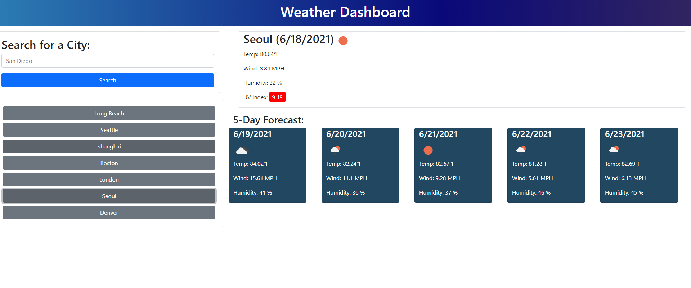

# Weather Dashboard

https://j92pruitt.github.io/weather-dashboard/

## Description 

A dashboard for looking up weather by city and displaying relevant current weather data as well as a five day forecast.  Previously searched cities will be stored in local storage and can be recalled by clicking the button for that city.

## Conclusion
Through this project I was able to get experience using fetch to request information from an API as well as using .then in order to process and render the information onto the page for the user to see.